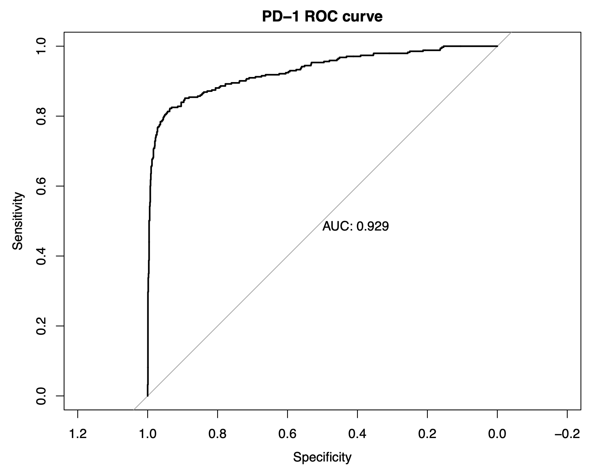
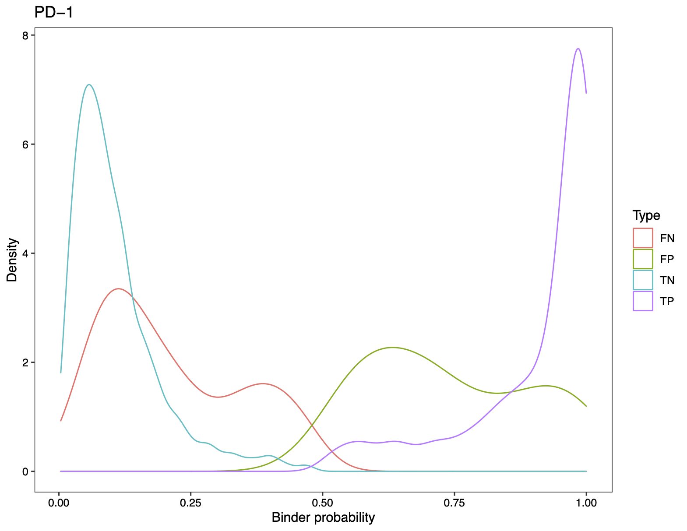
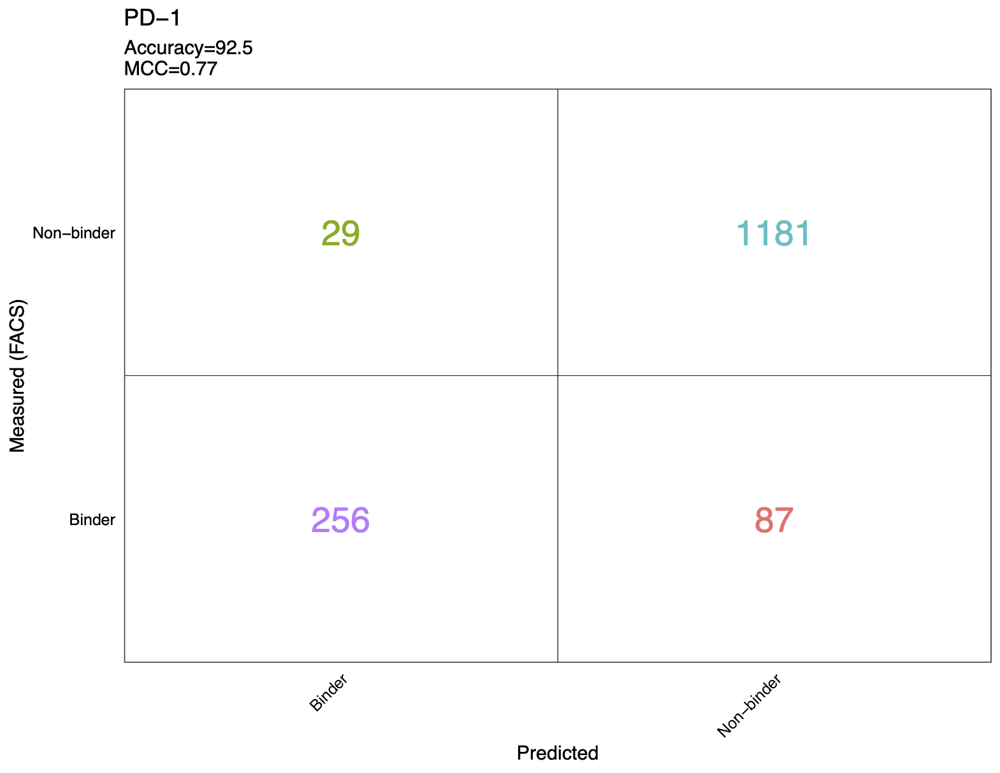
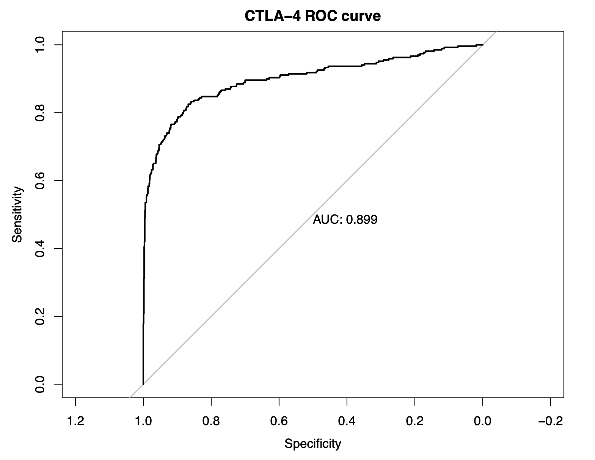
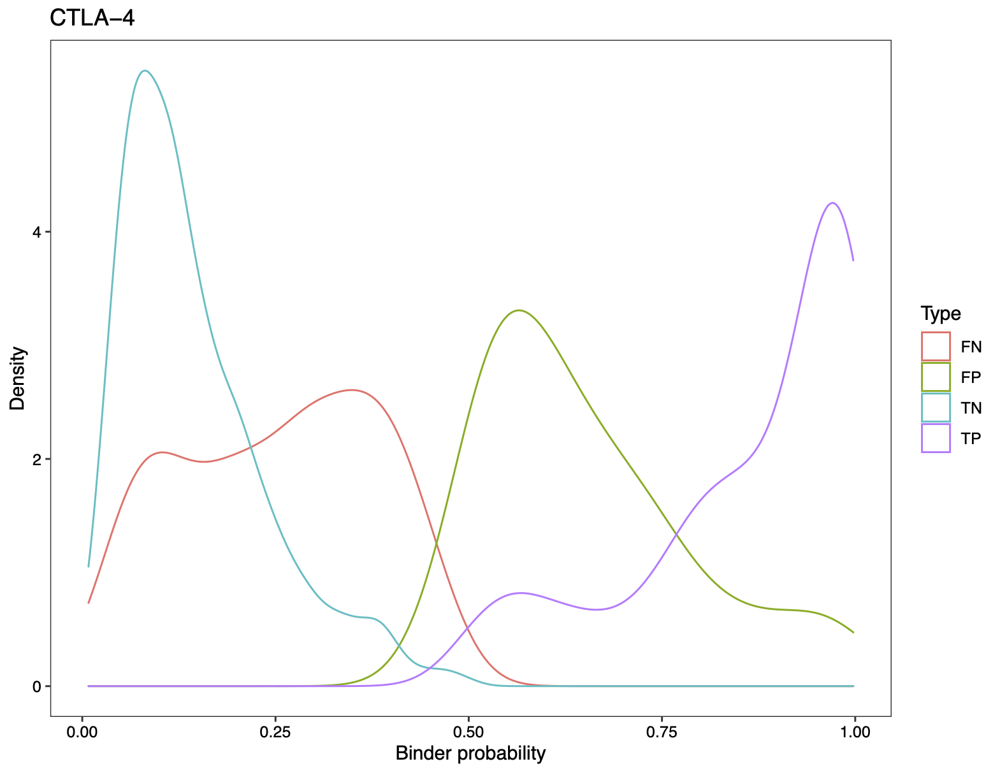
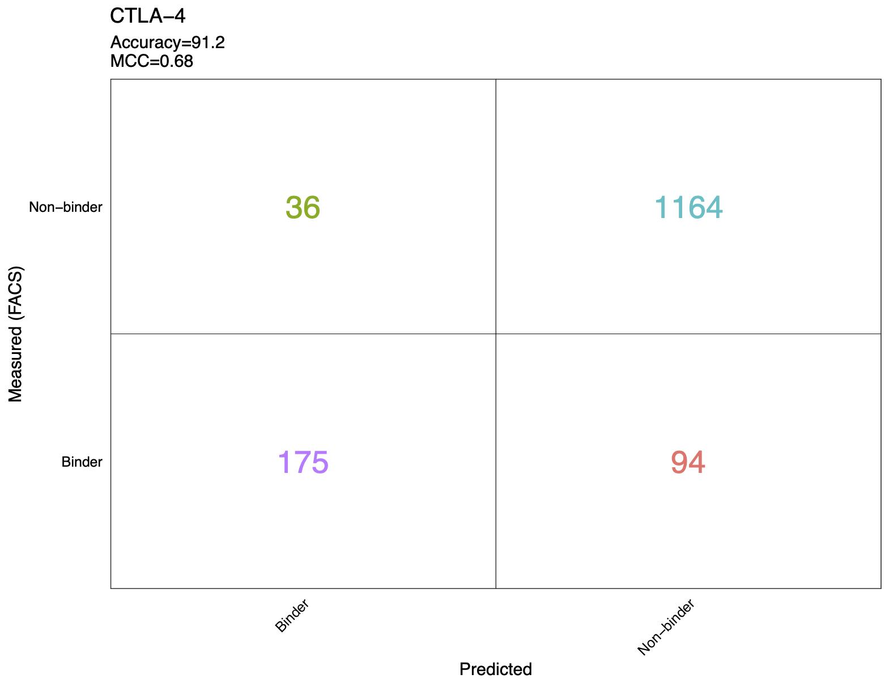
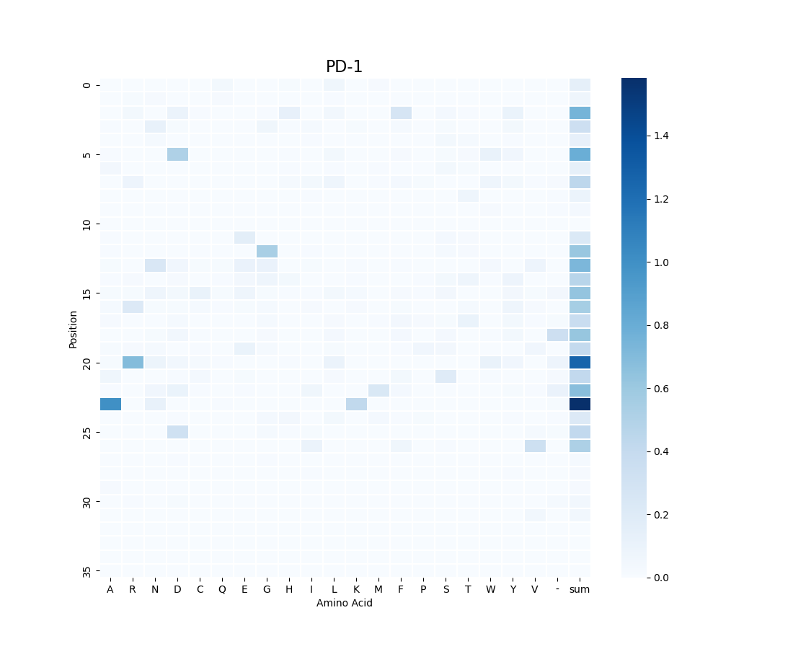
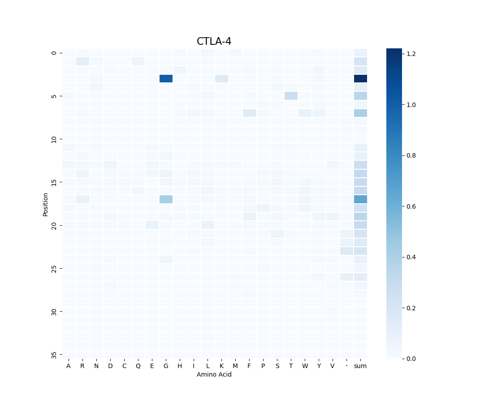

# Predicting Antibody Binders using Deep Learning

This repository contains Python code for deeper analysis of the results of the paper "Predicting antibody binders and generating synthetic antibodies using deep learning".

We implemented models using CNN (Convolutional Neural Networks), Random Forest, and Decision Trees to predict the antibody binding for CTLA-4 and PD-1.

## Results

Here are some results from our implementation:

Also, we did some feature analysis of the input amino acid sequence. Here is a plot of the amino acid importance heatmap. This result is generated based on the feature analysis of a Decision Tree:

